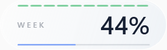

# Codex Glass

[简体中文](README.md) | **English**

A floating glass-style widget for Codex usage limits on Windows and macOS. Ten green segments at the top show your remaining five-hour allowance; the blue bar and percentage show your remaining weekly allowance. Hover to see the weekly reset countdown.

**macOS:** The native Swift / AppKit app supports macOS 13 and later, with adjustable background opacity, an optional five-hour percentage, and launch at login. Start with the [macOS installation and usage guide](macos/README.en.md). The installation, removal, and troubleshooting sections below primarily cover Windows.

**[Download the latest release](https://github.com/lunarfairy/codex-glass/releases/latest)** · [Report an issue](https://github.com/lunarfairy/codex-glass/issues)


> An unofficial community project, not affiliated with OpenAI.

## Preview

| Default view | On hover |
| :---: | :---: |
|  |  |

The green segments show your **remaining five-hour allowance**. The percentage and blue bar show your **remaining weekly allowance**. Hovering expands the widget to reveal the weekly reset countdown. Values in these screenshots are examples; actual values update with your account.

The current app controls and countdown text are in Chinese. This page provides English setup instructions; it does not change the app's interface language.

## Features

- A light, translucent capsule that stays on top and can be dragged around the desktop.
- Ten green segments at the top, each representing approximately 10% of the remaining five-hour allowance, rounded to the nearest segment.
- A weekly percentage and blue progress bar, with a weekly reset countdown on hover.
- Appears only while the Codex desktop app is running.
- A desktop **Codex Glass** shortcut opens controls for the overlay and Windows startup.
- Uses the official Codex CLI you install separately to read usage limits for its signed-in account. Codex Glass does not read or store chat content, prompts, source code, or access tokens.

## Windows installation

For Windows 10/11 x64. The ZIP includes the .NET runtime; no development tools, compilation, or administrator privileges are required to install Codex Glass.

1. Install Codex CLI yourself using the [official instructions](https://github.com/openai/codex#quickstart). If Node.js is already installed, you can also run `npm install -g @openai/codex`. Open a new terminal afterward and confirm that `codex --version` works.
2. Run `codex` in a terminal and choose **Sign in with ChatGPT**. Open the Codex desktop app and sign in to the same account. The account must provide five-hour/weekly usage-limit data; API-key-only configurations are not supported for this display.
3. Open the [latest release](https://github.com/lunarfairy/codex-glass/releases/latest) and download **CodexGlass-v1.0.3-windows-x64.zip** under **Assets**. Do not download the automatically generated `Source code` archives.
4. Right-click the ZIP and select **Extract All**, then double-click **安装.cmd** (Install) inside the extracted folder. Do not run it from the ZIP preview or copy only the EXE.
5. The control panel opens automatically after installation. Leave **显示悬浮条** (Show overlay) enabled, then open the Codex desktop app. The first quota read may take a moment; usage normally refreshes about once a minute.

Use the desktop **Codex Glass** shortcut to reopen the controls. **开机自动启动** means “Start with Windows.” Drag the overlay to reposition it; its position is saved automatically. Closing the control panel leaves the overlay running in the background. Closing the Codex desktop app hides the overlay.

## Updating and uninstalling

To update, download and extract the new release and run its **安装.cmd**. You do not need to uninstall first. Your overlay position and toggle settings are retained, but installation re-enables Windows startup; you can turn it off in the control panel.

To uninstall, run **卸载.cmd** (Uninstall) from the extracted folder. This removes Codex Glass, its desktop shortcut, startup entry, and settings. It does not uninstall your separately installed Codex CLI or desktop app, or delete your Codex account configuration.

## Troubleshooting

- **“Codex CLI is required”**: Install the official CLI first. Open a new terminal, check `codex --version`, and rerun the installer. If the installer still cannot find it, sign out of Windows and back in to refresh the PATH inherited by applications.
- **No overlay**: Open the control panel from the desktop shortcut, enable **显示悬浮条**, and keep the official Codex Windows desktop app running. The CLI or browser alone will not make the overlay appear.
- **“—” or usage limits cannot be read**: Run `codex` in a terminal to check that you are signed in with ChatGPT and that the CLI can connect. Close and reopen the Codex desktop app. The widget shows usage for the account signed in through the CLI.
- **Download or login times out**: First verify that the official CLI can connect on its own. If a proxy is needed, use your own proxy configuration. Codex Glass does not assume port 7897 or any other fixed port.
- **Windows reports an unknown publisher**: The release is currently unsigned. Confirm that the ZIP came from this repository's Releases page and, if needed, compare it against the supplied SHA256 checksum. Do not disable system protection.
- **Garbled text or syntax errors in an old installer/uninstaller**: Use the scripts from the latest release after fully extracting the ZIP. The PowerShell scripts use ASCII content for compatibility with Windows PowerShell 5.1 and Chinese user paths.

If you still need help, [open an issue](https://github.com/lunarfairy/codex-glass/issues) with your Windows version, Codex Glass version, `codex --version` output, and an error screenshot. Do not upload account tokens or `auth.json`.

## Development

See the [macOS development guide](macos/README.en.md) to build, test, and package the Mac app. GitHub Actions checks Windows, Apple Silicon, and Intel Mac builds separately and uploads the Mac installation archives.

Windows requirements: Windows and the .NET 8 SDK.

```powershell
dotnet test CodexGlass.sln --configuration Release
./packaging/Build-Release.ps1 -Version '1.0.3'
```

The release does not bundle or download Codex CLI. The installer checks that a working official CLI is available, installs the app, registers Windows startup, and creates a desktop shortcut for the controls.

## Privacy

Codex Glass only requests usage-limit information from the local Codex app-server. It does not open a network listening port, upload information to third parties, or proxy Codex requests.

## License

Released under the [MIT License](LICENSE).
